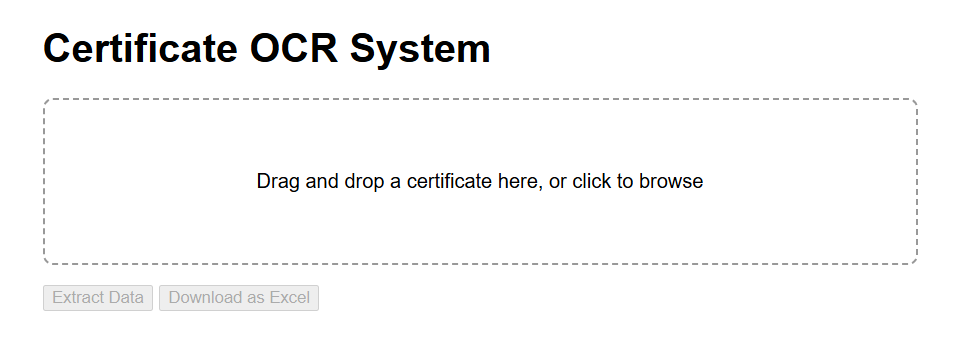
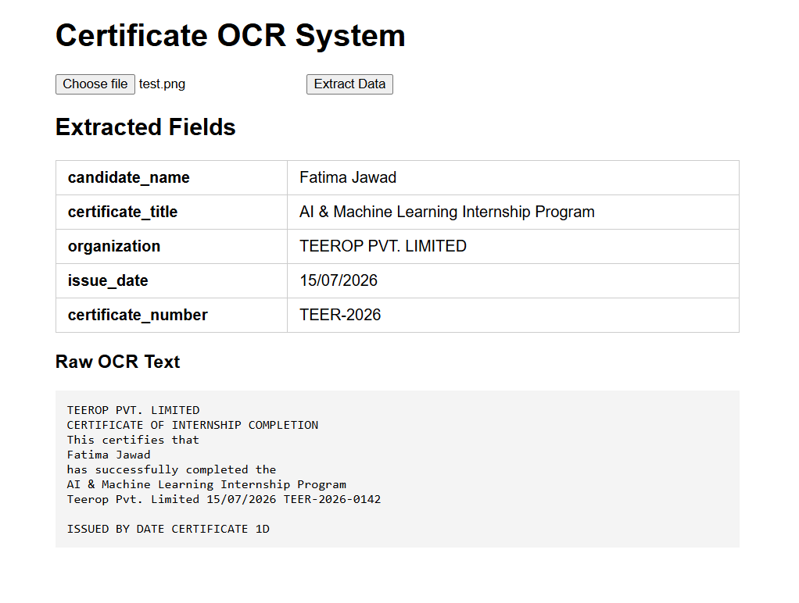
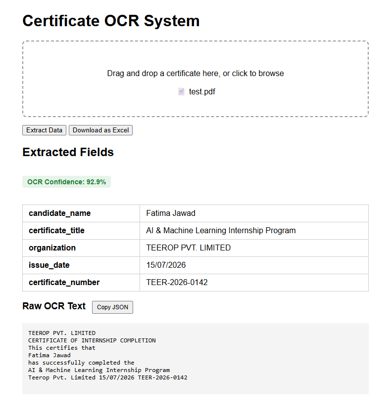
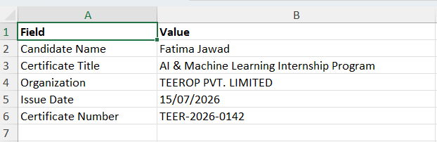

# Certificate OCR System

A full-stack web application that automatically extracts structured information
(candidate name, certificate title, issuing organization, date, and certificate
number) from certificate images and PDFs using Tesseract OCR — with database
persistence, batch processing, and Excel export.

Built as Task 1 for the Teerop Pvt. Limited AI & Machine Learning Internship Program.

---

## Screenshots

**Drag-and-drop upload interface**


**Text extraction from a real certificate**


**OCR confidence indicator + copy-to-clipboard JSON export**


**One-click Excel export**



---

## Features

### Core Pipeline
- Drag-and-drop or click-to-browse upload for certificate images (JPG, PNG, TIFF) or PDFs
- OCR text extraction powered by Tesseract
- Image preprocessing pipeline: upscaling, grayscale conversion, automatic deskewing,
  and adaptive thresholding to improve accuracy on decorative or tilted certificates
- Rule-based structured field extraction: candidate name, certificate title,
  organization, issue date, certificate number
- OCR confidence scoring with a color-coded on-page indicator (green ≥75%,
  yellow 50–74%, red <50%)

### Data & Export
- SQLite database persistence — every extraction is automatically saved
- `GET /results/{id}` to retrieve any past extraction
- `DELETE /documents/{id}` to remove a saved record
- Batch processing endpoint (`/extract-batch`) for handling multiple certificates
  in a single request
- One-click Excel (.xlsx) export of extracted fields, with auto-sized columns
  and formatted headers
- Copy-to-clipboard button for extracted data as JSON

### Reliability
- Graceful error handling on both backend and frontend (no raw stack traces
  or browser popups shown to the user)
- Specific, actionable error messages for common failure modes (missing
  Tesseract, missing Poppler, empty files, unsupported formats, memory errors)
- Unit tests for extraction logic and integration tests for API endpoints

---

## Tech Stack

| Component | Technology |
|---|---|
| Backend | FastAPI (Python 3.11+) |
| OCR Engine | Tesseract OCR 5.0+ |
| Image Processing | OpenCV, Pillow, NumPy |
| PDF Processing | pdf2image + Poppler |
| Database | SQLite via SQLAlchemy |
| Excel Export | openpyxl |
| Frontend | HTML / CSS / JavaScript (vanilla) |
| Testing | pytest, httpx |

---

## System Architecture

```
┌───────────────────────┐
│   Frontend (HTML/JS)   │  Drag-and-drop upload, results display, Excel download
└───────────┬────────────┘
            │ HTTP (multipart/form-data)
┌───────────▼────────────┐
│    FastAPI Backend      │  Routing, validation, error handling
└───────────┬────────────┘
            │
   ┌────────┼─────────┬──────────────┐
   ▼        ▼         ▼              ▼
┌───────┐ ┌──────┐ ┌──────────┐ ┌───────────┐
│Preproc │ │ OCR  │ │Extractor │ │  SQLite   │
│(OpenCV,│ │(Tess-│ │ (regex / │ │ (persist  │
│deskew) │ │eract)│ │ keyword) │ │  results) │
└───────┘ └──────┘ └──────────┘ └───────────┘
```

**Processing flow:** Upload → validate file type/size → save temp file →
preprocess image (upscale, deskew, threshold) → OCR extraction with confidence
scoring → structured field parsing → save to database → return JSON response.

---

## Setup

### Prerequisites
- Python 3.11+
- [Tesseract OCR](https://github.com/UB-Mannheim/tesseract/wiki) (Windows installer)
- [Poppler for Windows](https://github.com/oschwartz10612/poppler-windows/releases)

### Installation
```bash
git clone https://github.com/fatima08-ai/certificate-ocr-system
cd certificate-ocr-system
python -m venv venv
venv\Scripts\activate
pip install -r requirements.txt
```

After installing Tesseract and Poppler, update the paths in
`app/core/ocr_engine.py` to match your local installation:

```python
pytesseract.pytesseract.tesseract_cmd = r'C:\Program Files\Tesseract-OCR\tesseract.exe'
POPPLER_PATH = r'C:\poppler\poppler-26.02.0\Library\bin'
```

### Running the Application
```bash
uvicorn main:app --reload
```
Visit `http://127.0.0.1:8000` in your browser. The SQLite database
(`certificates.db`) is created automatically on first startup.

### Running Tests
```bash
python -m pytest tests/
```

---

## API Endpoints

| Method | Endpoint | Description |
|--------|----------|-------------|
| GET | `/` | Web interface for certificate upload |
| GET | `/health` | Health check |
| POST | `/extract` | Upload a single certificate and extract data |
| POST | `/extract-batch` | Upload multiple certificates in one request |
| GET | `/results/{id}` | Retrieve a previously saved extraction |
| DELETE | `/documents/{id}` | Delete a saved extraction record |
| POST | `/export` | Upload a certificate and download results as Excel |

### Example Request
```python
import requests

files = {'file': open('certificate.png', 'rb')}
response = requests.post('http://localhost:8000/extract', files=files)
print(response.json())
```

### Example Response
```json
{
  "id": 1,
  "filename": "certificate.png",
  "raw_text": "...",
  "confidence": 93.8,
  "extracted_fields": {
    "candidate_name": "Fatima Jawad",
    "certificate_title": "AI & Machine Learning Internship Program",
    "organization": "TEEROP PVT. LIMITED",
    "issue_date": "15/07/2026",
    "certificate_number": "TEER-2026-0142"
  }
}
```

---

## Known Limitations

- **Cursive/script fonts are unreliable.** Field extraction — particularly
  candidate names — fails on certificates using decorative script fonts,
  since Tesseract is trained primarily on standard printed text. This was
  tested and confirmed during development (see `sample_certificates/` for
  both a successful plain-font example and a failed cursive-font example).
- **Field extraction is rule-based**, using regex and keyword matching tuned
  to common certificate layouts (e.g. "This certifies that", "has successfully
  completed"). Certificates with significantly different structure or wording
  may not extract all fields correctly, or may place text in the wrong field.
- **Organization detection** assumes the issuing organization's name appears
  on the first line of the certificate. This heuristic worked well for the
  tested samples but is not guaranteed to generalize to all certificate formats.
- **Confidence scoring reflects raw OCR word confidence**, not extraction
  accuracy. A high confidence score means Tesseract read the text characters
  reliably — it does not confirm that the regex/keyword extraction correctly
  identified which text belongs in which field.
- **No authentication or access control.** This is a prototype/demo-stage
  application; all endpoints are open. A production version would need user
  authentication and per-user data isolation before handling real certificates.
- **Batch upload has no dedicated frontend UI.** The `/extract-batch` endpoint
  is fully functional and tested via direct API calls, but the web interface
  currently only exposes single-file drag-and-drop upload.
- **Deskew correction is angle-based only** and corrects in-plane rotation
  (tilted scans). It does not correct perspective distortion from certificates
  photographed at an angle rather than scanned flat.

---

## Project Structure

```
certificate-ocr-system/
├── app/
│   ├── core/
│   │   ├── ocr_engine.py       # OCR + PDF processing + confidence scoring
│   │   ├── preprocessor.py     # Image enhancement (upscale, deskew, threshold)
│   │   └── extractor.py        # Structured field extraction
│   └── models/
│       └── database.py         # SQLAlchemy models and session management
├── templates/
│   └── index.html              # Web interface
├── tests/
│   ├── test_api.py             # API endpoint tests
│   └── test_extractor.py       # Extraction logic unit tests
├── sample_certificates/        # Sample test certificates (clean + hard-case)
├── screenshots/                # Application screenshots
├── uploads/                    # Temporary upload storage
├── certificates.db             # SQLite database (auto-created on startup)
├── main.py                     # Application entry point and all routes
├── requirements.txt
└── README.md
```

---

## Future Improvements

- Batch upload UI on the frontend (currently API-only)
- Confidence-weighted field validation (flag low-confidence fields for manual review)
- Multi-language OCR support
- QR/barcode detection for certificates that embed verification codes
- User authentication and per-user document history
